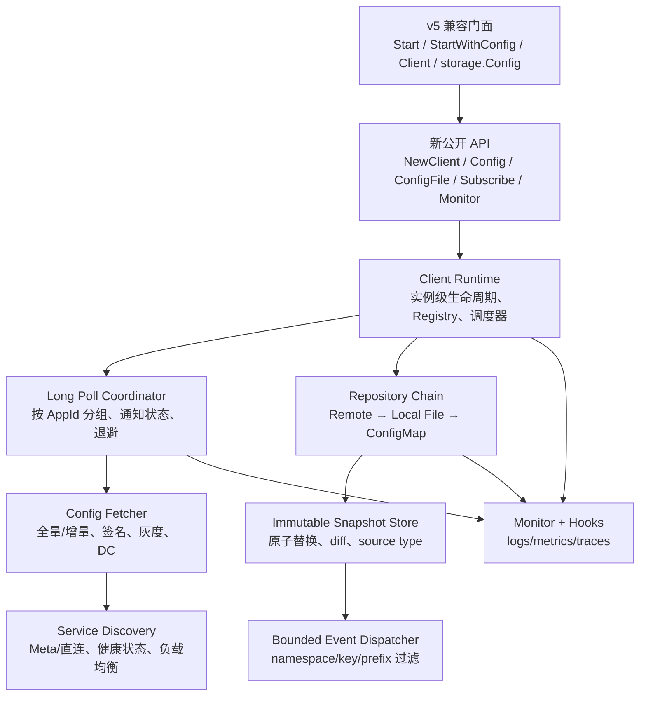

# agollo 重构与 Apollo Java Client 能力迁移方案

> 状态：方案已评审并完成首轮内核落地；完整迁移仍按第 8 节分阶段推进。
> 调研日期：2026-08-17
> 目标：在保持 agollo v5 既有功能和主要公开 API 可兼容迁移的前提下，完成内核重构，并补齐 Apollo Java Client 中适用于 Go 客户端的能力。

## 1. 结论摘要

建议采用“兼容优先、内核替换、能力分批补齐”的双阶段策略：

1. 先在 v5 兼容线上建立行为基线和兼容门面，不直接重写公开 API。
2. 用实例级、无全局可变状态的新内核替换发现、拉取、长轮询、缓存、事件和容灾链路。
3. 优先迁移多 AppId、增量同步、ConfigFile、监听过滤、来源标识、本地文件容灾等 Java Client 核心能力。
4. 再补齐 Kubernetes ConfigMap、客户端监控、Prometheus/OpenTelemetry、Mock Server/TestKit 等增强能力。
5. v5.x 先发布兼容实现；经过至少一个稳定周期后，再决定是否发布用于清理历史 API 的 v6。不要一开始就以 v6 大改作为交付前提。

推荐的目标架构不是逐个翻译 Java 类，而是保持 Apollo 协议和行为语义一致，同时使用 Go 的 `context.Context`、不可变快照、显式依赖注入、接口组合和可关闭 goroutine 来实现。

预计总工作量为 **16～21 人周**。2～3 名熟悉 Go、Apollo 协议和 Kubernetes 的开发者并行实施，建议排期 **9～12 周**，另预留 2 周灰度观察期。

## 2. 调研基线与范围

### 2.1 固定基线

为避免后续因主分支变化造成范围漂移，本方案以以下版本为基线：

| 项目 | 基线 | 说明 |
| --- | --- | --- |
| agollo | [`2ced0e9`](https://github.com/apolloconfig/agollo/commit/2ced0e9caf6aecd5a4fa9c6ec98658c8431766ba) | 本地工作树，`v5.0.0-2-g2ced0e9`，2026-05-30 |
| Apollo Server/文档 | [`2e2d591`](https://github.com/apolloconfig/apollo/commit/2e2d59173360be51c4720e7d2334226ed7d5dcb8) | Apollo 主仓库，2026-08-16 |
| Apollo Java Client | [`023217c`](https://github.com/apolloconfig/apollo-java/commit/023217c7683d647de52f44045655b9e8b382d0fd) | `2.6.0-SNAPSHOT`，2026-06-21 |

需要特别说明：Apollo Java Client 源码已经从 `apolloconfig/apollo` 主仓库迁到独立的 [`apolloconfig/apollo-java`](https://github.com/apolloconfig/apollo-java) 仓库。Apollo 主仓库仍然是服务端协议和用户文档基准，能力实现应以 `apollo-java` 为准。

### 2.2 纳入范围

- agollo 现有公开能力和行为兼容。
- Apollo Config Service 的服务发现、配置拉取、长轮询、灰度、签名、容灾协议。
- Java Client 中与语言无关或可以自然映射到 Go 的客户端能力。
- 测试、可观测性、安全性、性能、发布和回滚方案。
- 从 v5 旧 API 到新 API 的迁移路径。

### 2.3 不直接移植的能力

以下能力与 Java/Spring 运行时强绑定，不应机械移植到 agollo 核心包：

| Java 能力 | Go 侧处理 |
| --- | --- |
| Spring Placeholder、`@ApolloConfig`、`@ApolloJsonValue` | 不进入核心；可提供独立的结构体绑定/回调适配包 |
| Spring Boot ConfigData、自动刷新 Bean | 不移植；由各 Go 框架适配器实现 |
| JMX | 用进程内 `Monitor` API、Prometheus 和 OpenTelemetry 替代 |
| Java SPI/Guice | 用构造参数、Functional Options 和小接口替代 |
| Log4j2 插件 | 不移植；保留 `slog`/自定义 Logger 适配能力 |
| Java `apollo-openapi` 管理端 SDK | 不属于运行时配置 Client；如有需求应作为独立 Go 模块立项 |
| Java System Properties 覆盖 Spring Environment | 转化为明确的 Go 配置优先级，不模拟 JVM 行为 |

## 3. agollo 现状盘点

### 3.1 已具备能力

当前 agollo 已具备以下基础，重构必须保留：

- 多 Config Service 地址、Meta Server 服务发现和可替换负载均衡。
- 配置首次同步、长轮询更新、`releaseKey`/HTTP 304。
- 多 namespace、运行时延迟加载 namespace。
- 灰度发布 `label`、客户端 IP、访问密钥签名。
- 内存缓存和本地 JSON 备份降级。
- properties、yaml/yml 解析，其他格式原文可经 `content` 获取。
- 字符串、整数、浮点数、布尔值、字符串/整数切片读取。
- 全量和差量变更事件、正则 key 分发。
- Logger、Cache、FileHandler、认证、解析器、负载均衡扩展点。
- `MustStart` 启动保护及 `Close` 停止后台组件。

### 3.2 当前测试基线

- 仓库有 41 个 `*_test.go` 文件、约 149 个 `Test*` 用例。
- 首轮实现前，根包 `TestGetConfigAndInitValNotNil` 依赖 `gomonkey` 的运行时代码替换，在 Go 1.26.4 上会因测试顺序而失效。现已将同步函数改为 `internalClient` 的实例依赖并删除该运行时 patch；协议超时用例也改为单调时钟的区间断言。
- 当前分支已验证 `go test ./... -count=1` 和新客户端的 `go test -race . -run '^TestModernClient' -count=1`。持续多轮、跨平台稳定性仍是 M0/M6 发布门禁的一部分。

### 3.3 需要在重构中解决的结构问题

| 问题 | 影响 | 处理原则 |
| --- | --- | --- |
| `extension`、`env`、HTTP Transport、同步器等包级全局状态 | 多 Client 相互污染，测试不稳定，难以支持多 AppId | 新内核全部实例化；旧全局 setter 只配置后续创建的 legacy client |
| `AppConfig.NamespaceName` 在运行时拼接修改 | 长轮询与动态 namespace 并发读写风险 | 使用并发安全的 subscription registry，不再修改配置字符串 |
| 事件回调每次直接启动 goroutine | 无背压、无顺序保证、慢监听器可能造成 goroutine 膨胀 | 每 Client 使用有界 dispatcher，定义顺序和溢出策略 |
| 内存缓存接口带过期时间，但默认实现忽略过期；计数在覆盖写时仍递增 | 扩展实现语义不一致，`EntryCount` 不准确 | 新 Snapshot Store 不使用 TTL；旧 Cache 仅作为兼容适配器 |
| HTTPS 路径可能默认设置 `InsecureSkipVerify`，且 Transport 由首次请求决定 | 安全风险、不同请求顺序导致行为不一致 | TLS 校验默认开启；不安全模式必须显式配置并告警 |
| HTTP 重试固定次数、固定间隔、不可通过 Context 取消 | 关停慢、雪崩时放大请求 | 指数退避、抖动、错误分类、Context 取消、QPS 限制 |
| 响应体关闭、大小限制、错误类型不清晰 | 连接复用和故障诊断受限 | 每次请求及时关闭，限制 body，暴露结构化错误 |
| 备份文件路径存在全局 map 和 key 语义问题，写入非原子 | 多 AppId/namespace 可能串文件，崩溃时可能留下半文件 | 纯函数生成路径，临时文件 + rename，兼容读取旧文件名 |
| 空配置可能无法完成初始化等待 | Getter 可能永久等待 | 空配置也是有效快照，必须完成 ready 状态 |
| `UseEventDispatch` 返回值不可用、监听器范围是 Client 全局 | 难以按 namespace/key 精确订阅 | 新 API 返回取消函数，支持 namespace、精确 key 和 key 前缀 |
| 核心依赖和配置加载耦合较重 | 升级、裁剪、测试成本高 | 核心优先标准库；YAML、K8s、指标放到可选模块 |

## 4. Java Client 能力差距矩阵

优先级定义：P0 为首个兼容版本必须具备；P1 为 Java 能力对齐版本必须具备；P2 为可选生态增强。

| 能力 | agollo 现状 | 目标 | 优先级 |
| --- | --- | --- | --- |
| 基础 KV 获取 | 已支持 | 保持 v5 行为；新 API 返回明确的存在性/错误 | P0 |
| 类型化读取 | int/float/bool/slice | 增加 int64、uint、duration、time、文本反序列化和泛型 decode helper | P1 |
| Property Names | 需遍历底层 Cache | 提供稳定的 `Keys()`/`Range()` 快照 API | P0 |
| 多 namespace | 已支持，动态修改字符串 | 并发安全、按需创建、同一 namespace 单例 | P0 |
| 单进程多 AppId | 主要依赖多个 Client，内部全局状态有冲突风险 | `{appId, cluster, namespace, format}` 作为完整身份，单 Client 可读取指定 AppId | P0 |
| ConfigFile API | 无等价公开 API | 原文内容、格式、来源、监听；properties/yaml 可转换 KV | P0 |
| 文件格式 | properties/yaml/yml 较完整，XML/JSON/TXT 原文语义不统一 | properties、xml、json、yaml、yml、txt 与 Java 枚举对齐 | P0 |
| 变更监听 | Client 全局监听；有正则 dispatcher | namespace 级监听、精确 key、key prefix、取消订阅；保留 legacy 事件 | P0 |
| 配置来源 | 无公开来源类型 | `Remote`、`LocalFile`、`ConfigMap`、`None` | P0/P1 |
| 服务发现 | 已支持 Meta/直连 | 明确配置优先级、周期刷新、QPS 限制、可观测状态 | P0 |
| 负载均衡 | 全局可插拔 round-robin | 实例级策略；默认随机/轮转并优先使用通知节点 | P0 |
| 长轮询 | 已支持 | 按 AppId 分组；90 秒读超时；失败指数退避和抖动 | P0 |
| `messages` 通知元数据 | 未支持 | 接收、合并并在配置拉取时回传，为增量同步提供基础 | P0 |
| 增量配置同步 | 未支持 | 识别 `configSyncType` 和 `configurationChanges`，原子合并；未知类型安全失败 | P0 |
| Data Center | 未形成完整配置/请求语义 | 配置拉取和长轮询均传递 `dataCenter` | P0 |
| `releaseKey`/304 | 已支持 | 保持，纳入协议契约测试 | P0 |
| Label/灰度 | 已支持 | 保持，纳入协议契约测试 | P0 |
| Access Secret | 已支持 | 支持按 AppId 提供 Secret，日志统一脱敏 | P0 |
| 本地文件容灾 | JSON 备份，读写语义较弱 | Repository 链；原子持久化；兼容旧 JSON 和 Java properties 命名 | P0 |
| Local Mode | 无完整离线模式 | 禁止访问远端，仅从指定本地目录加载 | P1 |
| Kubernetes ConfigMap 容灾 | 未支持 | `remote -> local file -> ConfigMap` 降级；冲突重试和 RBAC 文档 | P1 |
| 客户端 Monitor API | 无 | 启动参数、namespace 状态、异常计数、任务队列、来源和更新时间 | P1 |
| Prometheus exporter | 无 | 独立可选模块，指标名尽量与 Java Client 对齐 | P1 |
| OpenTelemetry | 无 | 提供 metric/tracing hook，默认不引入 OTel SDK | P2 |
| Mock Server/TestKit | 仅仓库内部测试 | 可被业务项目引用的 mock server、fixture 和断言工具 | P1 |
| HTTP Client 扩展 | 认证可替换，Transport 不易定制 | 支持自定义 `http.Client`/`RoundTripper`/middleware | P0 |
| SPI/Injector 定制 | 依赖全局 setter | Functional Options + 明确接口；无隐式 Service Loader | P0 |
| 配置项顺序 | Go map 无顺序保证 | ConfigFile 保留原文；KV API 不承诺顺序；必要时提供有序解析结果 | P2 |

## 5. 目标架构

### 5.1 分层结构



### 5.2 建议目录

```text
agollo/
├── client.go                  # 新公开 Client API
├── config.go                  # Config / ConfigFile / Snapshot
├── options.go                 # Functional Options
├── monitor.go                 # 稳定的监控查询接口
├── legacy/                    # 内部兼容适配实现，不新增用户依赖
├── internal/
│   ├── runtime/               # 生命周期、registry、任务编排
│   ├── protocol/              # DTO、URL、签名、全量/增量协议
│   ├── transport/             # HTTP、重试、限流、middleware
│   ├── discovery/             # Meta/直连和负载均衡
│   ├── poller/                # 按 AppId 的长轮询协调器
│   ├── repository/            # Remote/File/ConfigMap repository
│   ├── snapshot/              # 不可变快照、diff、source
│   ├── event/                 # 有界事件分发
│   └── observability/         # 内部指标与 hook
├── adapter/
│   ├── kubernetes/            # 可选 ConfigMap Store
│   ├── prometheus/            # 可选 exporter
│   └── slog/                  # 标准日志适配
└── testkit/                   # Mock Apollo、fixture、协议断言
```

目录名可以在实现阶段调整，但必须坚持三个边界：公开 API 不依赖内部包；核心不强依赖 Kubernetes/Prometheus；legacy 只能调用新内核，不能复制一套运行时。

## 6. 核心设计

### 6.1 Client 与配置身份

内部统一使用以下身份键：

```go
type ConfigKey struct {
    AppID     string
    Cluster   string
    Namespace string
    Format    ConfigFileFormat
}
```

- `AppID + Cluster + Namespace + Format` 决定唯一配置对象。
- `GetConfig`/`GetConfigFile` 对同一 Key 返回同一逻辑实例。
- 动态 namespace 通过 registry 注册，不修改启动配置。
- Secret 支持默认值和按 AppId 覆盖。
- 一个 Client 共享 HTTP、服务发现和监控，但按 AppId 维护长轮询通知表。

建议新增 API 形态：

```go
client, err := agollo.NewClient(ctx,
    agollo.WithAppID("sample-app"),
    agollo.WithCluster("default"),
    agollo.WithMetaServer("http://apollo-meta:8080"),
    agollo.WithLocalCacheDir("/opt/data/sample-app/config-cache"),
)

cfg, err := client.Config(ctx, "application")
value, ok := cfg.Lookup("timeout")
cancel := cfg.Subscribe(listener,
    agollo.WithInterestedKeys("timeout"),
    agollo.WithInterestedKeyPrefixes("db."),
)
defer cancel()
```

最终 API 需要单独进行 API Review；上述代码只确定设计方向，不在方案阶段锁死命名。

### 6.2 不可变 Snapshot

- 每个 namespace 当前状态保存为不可变 Snapshot，并通过 `atomic.Pointer` 原子替换。
- Snapshot 至少包含：Key、原文、KV、releaseKey、notificationId、source、更新时间和格式。
- Getter 只读当前 Snapshot，不持有长锁。
- 增量配置先在副本合并并校验，再一次性发布，监听器永远看不到半更新状态。
- 空 map 是有效配置，必须发布并解除首次加载等待。
- 返回 map/slice 时复制或提供只读遍历，避免调用方修改内部状态。

### 6.3 协议和增量同步

配置拉取保持 `/configs/{appId}/{cluster}/{namespace}` 语义，并完整支持：

- `releaseKey`、`ip`、`label`、`dataCenter`、`messages`。
- 200 全量结果、304 未变化、404 namespace 未发布、401/403 认证错误。
- `configSyncType=FULL_SYNC`：替换整个 KV。
- `configSyncType=INCREMENTAL_SYNC`：按 ADDED/MODIFIED/DELETED 合并 `configurationChanges`。
- 未知 sync type、缺失关键字段或非法 change type：不发布新 Snapshot，保留旧配置并记录错误。
- 当本地没有可作为基线的旧 Snapshot 时，不接受增量结果，应立即发起一次不带增量上下文的全量拉取。

长轮询保持 `/notifications/v2` 语义：

- 通知 ID 按 AppId + namespace 隔离。
- 保存服务端返回的 `messages`，下次配置拉取时回传。
- 优先从返回通知的 Config Service 节点获取配置，随后恢复正常负载均衡。
- 网络/5xx 使用带抖动指数退避；401/403/404 不进行无意义快速重试。
- 所有等待均响应 Context 和 `Close`。

### 6.4 Repository 容灾链

默认顺序建议与 Java Client 行为对齐：

1. Remote Config Service。
2. Local File Cache。
3. Kubernetes ConfigMap（显式启用时）。
4. 全部失败则来源为 `None`。

规则：

- 远端成功后同步更新内存、本地文件，并异步更新 ConfigMap。
- 远端失败时优先读本地文件；本地也不可用时再读 ConfigMap。
- ConfigMap 写失败不能阻塞配置发布，但必须记录监控事件。
- Local Mode 下完全不创建远端发现和长轮询任务。
- 文件写入使用同目录临时文件、`fsync`（可配置）和原子 rename；默认权限不宽于 `0640`。
- 新格式建议兼容 Java 的 `{appId}+{cluster}+{namespace}.properties`；迁移期同时读取 agollo 旧 JSON 文件，成功读取后可惰性升级，但不得自动删除旧文件。

### 6.5 Config 与 ConfigFile

`Config` 面向 KV：

- `Lookup/GetString/GetInt/GetInt64/GetFloat64/GetBool/GetDuration/GetTime`。
- `Keys/Range/Decode`。
- `Source/ReleaseKey/LastUpdated`。
- namespace 级 change listener，支持精确 key 和前缀过滤。

`ConfigFile` 面向原文：

- `Content/HasContent/AppID/Namespace/Format/Source`。
- 原文变化监听。
- YAML/YML/Properties 可提供 `AsMap`；XML/JSON/TXT 不强制扁平化。
- 原文必须由服务端返回内容产生，不能通过 map 无序拼接伪造。

### 6.6 事件语义

- 同一 namespace 内按 Snapshot 发布顺序投递事件。
- 每次事件包含 old/new value、ADDED/MODIFIED/DELETED、releaseKey、source 和时间。
- 监听器异常或 panic 被隔离，不能终止 poller。
- 默认使用有界队列；达到上限时不静默丢弃，应增加 dropped 指标并按配置选择“合并到最新快照”或“阻塞有限时长”。
- 回调中调用 Getter 必须安全，不能产生死锁。
- 旧 `ChangeListener` 和 `FullChangeEvent` 由 compatibility adapter 生成，保持旧字段语义。

### 6.7 配置优先级

新 API 使用以下明确优先级，避免 Java System Property 语义直接搬到 Go：

1. 显式 Functional Option。
2. 显式传入的配置结构体/配置文件。
3. Apollo 标准环境变量，例如 `APP_ID`、`APOLLO_META`、`APOLLO_CONFIG_SERVICE`、`APOLLO_CLUSTER`、`APOLLO_ACCESS_KEY_SECRET`。
4. 兼容的 `app.properties`。
5. 默认值。

同一层冲突必须返回错误或记录确定性告警，不能依赖 map 遍历顺序。

### 6.8 可观测性

提供无第三方依赖的 `Monitor` 查询接口，并通过 hook 输出到具体系统。至少包括：

- Client 启动参数的非敏感子集、版本和当前 Config Service 地址。
- 每个 namespace 的使用次数、首次加载耗时、配置项数量、来源、releaseKey、最后更新时间。
- namespace not-found、timeout、拉取/长轮询错误计数。
- poller/dispatcher 当前队列深度、活跃任务、丢弃事件数。
- 请求次数、状态码、重试、发现刷新、文件/ConfigMap 读写结果。

Prometheus 模块尽量沿用 Java Client 的核心指标名，例如：

- `apollo_client_namespace_item_num`
- `apollo_client_namespace_first_load_time_spend_in_ms`
- `apollo_client_namespace_usage`
- `apollo_client_namespace_not_found`
- `apollo_client_namespace_timeout`
- `apollo_client_exception_num`

严禁把配置值、Secret、完整 URL query 或无限量 AppId/namespace 直接作为高基数 label。

## 7. 兼容策略

### 7.1 兼容承诺

v5 兼容阶段保留以下入口及主要行为：

- `Start`、`StartWithConfig`。
- 当前 `Client` 接口的全部方法。
- `env/config.AppConfig` 现有字段。
- `storage.Config` 的 Getter、立即返回 Getter 和内容读取。
- 现有 ChangeListener、FullChangeEvent、Event Dispatcher。
- Logger、CacheFactory、FileHandler、LoadBalance、HTTPAuth、FormatParser 扩展点。
- `MustStart`、备份配置、灰度和签名能力。

不得直接给现有 `Client`、`CacheInterface`、`ChangeListener` 等公开接口增加方法；Go 用户可能自行实现这些接口，新增方法会造成源码破坏。新能力应放入新接口，或通过可选的类型断言/adapter 暴露。

兼容不等于保留明显缺陷。以下修复允许改变错误行为，但必须写入 release note 和迁移文档：

- HTTPS 默认恢复证书校验。
- 空配置不再永久阻塞 Getter。
- `Close` 变为幂等并等待后台任务退出。
- 缓存覆盖写不再错误增加 EntryCount。
- 备份文件不再因全局路径 map 发生 namespace/AppId 串扰。

### 7.2 Compatibility Adapter

- `StartWithConfig` 将旧 `AppConfig` 翻译成新 Options，再创建新内核 Client。
- legacy Getter 继续返回默认值；新 API 额外暴露 `ok/error`。
- legacy 全局 setter 维护一个带锁的默认 Builder，仅影响之后创建的 legacy Client；已经运行的 Client 不被修改。
- 自定义旧 Cache 通过 Snapshot adapter 驱动，但新内核正确性不能依赖其 TTL/EntryCount 语义。
- 旧备份文件只读兼容，新文件用安全格式写入；提供一次性迁移工具和 dry-run。

### 7.3 版本策略

- **v5.x-alpha/beta**：新内核 + 完整兼容门面，默认可通过 feature flag 回退旧内核。
- **v5.x stable**：新内核默认启用，旧内核保留一个发布周期作为紧急回退。
- **后续 v5.x**：删除旧内核运行代码，但保留公开兼容门面。
- **v6（可选）**：只在需要真正删除旧 API/全局 setter 时发布；提前至少一个 minor 标记 deprecated。

不建议同时长期维护两套轮询、缓存和事件实现，否则 Java 能力会出现双份 bug 和语义漂移。

## 8. 分阶段实施计划

| 阶段 | 主要工作 | 交付物/退出条件 | 工作量 |
| --- | --- | --- | --- |
| M0 基线冻结 | API 清单、行为 golden test、稳定现有测试、race 基线、协议 fixture | 连续 20 次 `go test ./...` 无顺序失败；兼容清单评审通过 | 1～2 人周 |
| M1 新内核骨架 | Client lifecycle、Options、ConfigKey、Snapshot、registry、结构化错误、Context | 无网络的单元测试全绿；无包级运行时可变状态 | 2～3 人周 |
| M2 协议与运行时 | HTTP、发现、负载均衡、签名、全量拉取、长轮询、退避、动态 namespace | 与现有 v5 协议 fixture 等价；`-race` 通过 | 3～4 人周 |
| M3 兼容门面 | 旧 Client/AppConfig/Getter/Listener/扩展适配、旧备份读取 | 现有用户示例无需改调用逻辑；兼容测试全绿 | 2～3 人周 |
| M4 Java 核心对齐 | 多 AppId、ConfigFile、来源、key/prefix 监听、dataCenter/messages、增量同步、完整格式 | Java/Go 双实现契约用例结果一致 | 3～4 人周 |
| M5 高可用与可观测 | Local Mode、原子文件、ConfigMap、Monitor、Prometheus hook | 故障注入和 K8s 集成测试通过 | 3 人周 |
| M6 TestKit 与发布 | Mock Server、文档、迁移工具、benchmark、alpha/beta、灰度和回滚演练 | 发布门禁全部通过，至少两个真实业务灰度 | 2 人周 |

### 8.1 推荐合并顺序

每个 PR 应保持可回滚和单一关注点，推荐顺序：

1. 测试隔离与协议 fixtures。
2. Snapshot/ConfigKey/错误模型。
3. Transport 和 Discovery。
4. Poller 和 Repository。
5. 新 Client API。
6. legacy adapter。
7. multi-AppId 和增量同步。
8. ConfigFile 和事件过滤。
9. 本地文件与 ConfigMap。
10. Monitor/exporter/TestKit/文档。

不要在一个 PR 中同时改公开 API、网络协议和缓存实现。

## 9. 测试与验收

### 9.1 测试层次

1. **公开 API 编译测试**：编译 README、Wiki 和常见用户代码，保证旧 API 可用。
2. **行为 Golden Test**：记录 v5 的 Getter 默认值、初始化等待、listener 和备份恢复行为。
3. **协议契约测试**：覆盖 URL 编码、headers、签名、200/304/400/401/403/404/5xx、超时和 malformed body。
4. **Java/Go 对照测试**：同一组 Mock Server 脚本分别驱动 Java 和 Go Client，对比 Snapshot、来源和事件序列。
5. **并发测试**：动态 namespace、并发 Getter、订阅/取消、Close、服务列表刷新、多 AppId。
6. **容灾测试**：远端不可用、缓存损坏、磁盘只读、ConfigMap 冲突/无权限、DNS 故障、节点切换。
7. **资源测试**：长时间长轮询、慢 listener、频繁变更，检查 goroutine、连接、FD 和内存。
8. **兼容矩阵**：至少覆盖 Apollo Server 1.9.x、2.0.x、2.4.x、当前稳定版和主分支协议 fixture。

### 9.2 必测场景

- 首次加载成功、首次远端失败但本地恢复、所有来源失败且 `MustStart=true/false`。
- namespace 配置为空、删除最后一个 key、全量与增量混合。
- 304 不产生伪变更事件。
- 同一通知重复到达、通知乱序、notificationId 回退。
- properties namespace 的 `.properties` 后缀兼容。
- 同名 namespace 分属不同 AppId 时完全隔离。
- 每个 AppId 使用不同 Secret 时签名正确且日志不泄露。
- listener 只收到感兴趣 key/prefix，取消后不再收到事件。
- 回调阻塞、panic 或递归读取配置时 Client 继续工作。
- `Close` 在首次拉取、重试 sleep 和长轮询中都能及时退出。
- 旧 JSON 备份可读取，新备份原子写入，崩溃恢复无半文件。
- ConfigMap key 对 namespace 中下划线的转义与 Java Client 一致。

### 9.3 发布门禁

- `go test ./... -count=20` 无偶发失败。
- `go test -race ./...` 通过。
- `go vet ./...` 和选定 linter 通过。
- 公开 API 兼容检查无非计划破坏。
- 协议契约测试和 Java/Go 对照测试通过。
- 关键 benchmark 相比 v5：Getter P99 不退化超过 10%，稳态内存不退化超过 15%，每个 Client 的后台 goroutine 数有明确上限。
- 关闭 Client 后，无 poller/discovery/dispatcher goroutine 泄漏。
- 安全审查确认 TLS、Secret、文件权限、日志脱敏和 ConfigMap RBAC。
- 至少两个真实业务完成 7 天灰度，无配置丢失、事件乱序导致的业务故障或资源持续增长。

## 10. 风险与缓解

| 风险 | 概率/影响 | 缓解措施 |
| --- | --- | --- |
| 重构同时引入大量能力，回归面过大 | 高/高 | 分阶段 PR、兼容门面、协议 fixture、feature flag 和快速回退 |
| 旧用户依赖未文档化行为 | 高/高 | 收集真实用法、golden test、beta 灰度、明确列出允许修复的错误行为 |
| 多 AppId 导致通知和 Secret 串用 | 中/高 | 全链路使用 ConfigKey/AppId 分区，契约和 race 测试 |
| 增量结果丢失/乱序造成错误配置 | 中/高 | 无基线拒绝增量、原子合并、releaseKey/notification 校验、异常时强制全量 |
| 慢 listener 拖垮客户端 | 中/高 | 有界队列、合并策略、超时/丢弃指标、panic 隔离 |
| ConfigMap RBAC 或更新冲突 | 高/中 | 默认关闭、最小权限示例、resourceVersion 冲突重试、不阻塞内存发布 |
| 文件格式与旧备份不兼容 | 中/高 | 双读单写、dry-run 迁移工具、保留旧文件、故障注入 |
| TLS 行为修复影响使用自签名证书的用户 | 中/中 | 明确 CA 配置和显式 insecure 开关；beta 日志提前告警 |
| 指标 label 高基数 | 中/中 | label 白名单、默认不暴露 AppId 或对 namespace 数量设上限 |
| 核心依赖膨胀 | 中/中 | Kubernetes、Prometheus、YAML 增强放独立 adapter，核心优先标准库 |

## 11. 交付物

最终交付不只是一组代码，应包括：

- 架构决策记录（ADR）：Snapshot、容灾链、事件背压、多 AppId、增量同步、兼容策略。
- v5 公开 API 和行为兼容清单。
- Apollo 协议 fixture 与 Java/Go 对照测试工具。
- 新内核、legacy adapter、Kubernetes/Prometheus adapter、testkit。
- 旧备份扫描/迁移工具，支持 dry-run 和回滚说明。
- README 快速开始、完整配置参考、从旧 API 到新 API 的迁移指南。
- 性能、race、故障注入和灰度报告。
- Alpha/Beta/Stable 发布说明和一键回退操作手册。

## 12. 需要维护者确认的决策

建议按以下默认选项推进；如维护者不同意，应在 M0 结束前冻结：

1. **版本策略**：先发布兼容的 v5.x，新 API 稳定后再评估 v6。
2. **核心依赖**：Kubernetes 和 Prometheus 均为可选 adapter，不进入核心依赖。
3. **TLS**：默认严格校验证书，自签名通过 CA 配置解决；insecure 仅显式开启。
4. **事件过载**：默认合并为最新 Snapshot 并记录 dropped 指标，不允许无限 goroutine。
5. **本地缓存**：双读旧 JSON/新 properties，单写新安全格式，不自动删除旧文件。
6. **配置源顺序**：Remote → Local File → ConfigMap；Local Mode 例外。
7. **Java 特有能力**：Spring/JMX/OpenAPI 不进入 agollo 核心，使用 Go 原生等价能力或单独立项。
8. **Go 版本**：兼容重构阶段先维持当前 `go 1.20` 声明；确需提高最低版本时单独评审并公告，优先让 Kubernetes 等 adapter 使用独立模块隔离依赖。

## 13. 完成定义

只有同时满足以下条件，才能宣称迁移完成：

- agollo v5 已有功能和公开调用方式可兼容迁移。
- 本方案 P0、P1 项均有实现、文档和自动化测试。
- 多 AppId、ConfigFile、增量同步、来源链、监听过滤、ConfigMap 和 Monitor 通过验收。
- Java/Go 对照测试在同一协议脚本下结果一致；语言特有差异已有书面说明。
- 完整测试连续稳定，race、资源、安全和性能门禁通过。
- 至少两个生产或等价环境业务完成灰度，且回滚方案演练成功。

## 14. 参考资料

- [agollo](https://github.com/apolloconfig/agollo)
- [Apollo 主仓库](https://github.com/apolloconfig/apollo)
- [Apollo Java Client](https://github.com/apolloconfig/apollo-java)
- [Apollo Java SDK 使用指南](https://github.com/apolloconfig/apollo/blob/master/docs/zh/client/java-sdk-user-guide.md)
- [Apollo Java 2.4.0 变更记录](https://github.com/apolloconfig/apollo-java/blob/main/changes/changes-2.4.0.md)
- [Apollo Java Client Config API](https://github.com/apolloconfig/apollo-java/blob/main/apollo-client/src/main/java/com/ctrip/framework/apollo/Config.java)
- [Apollo Java Client ConfigFile API](https://github.com/apolloconfig/apollo-java/blob/main/apollo-client/src/main/java/com/ctrip/framework/apollo/ConfigFile.java)
